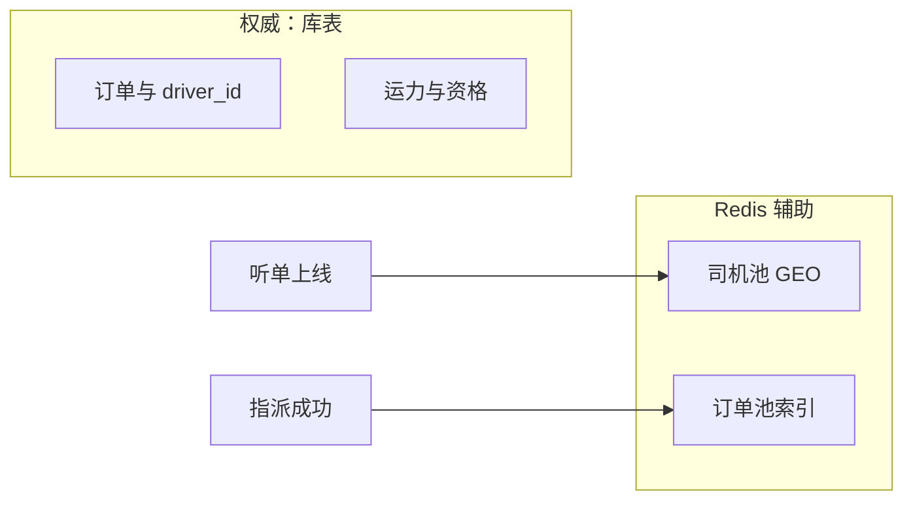
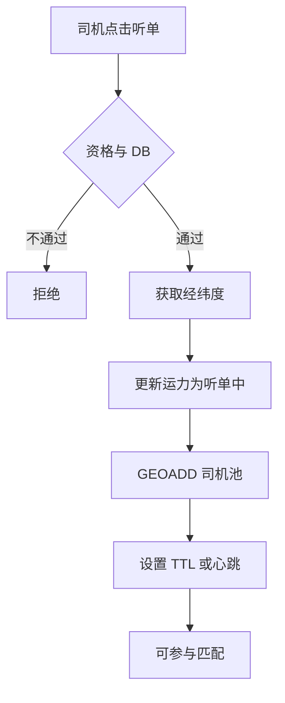
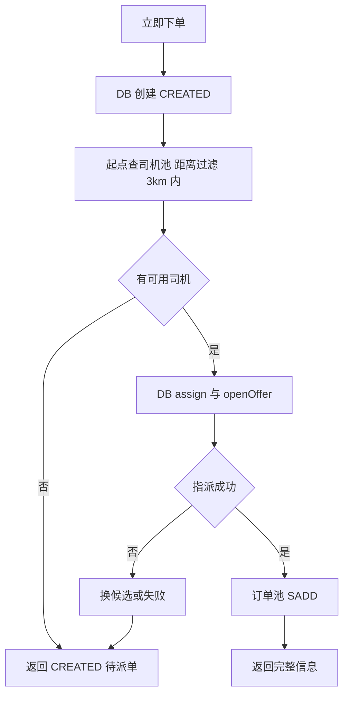
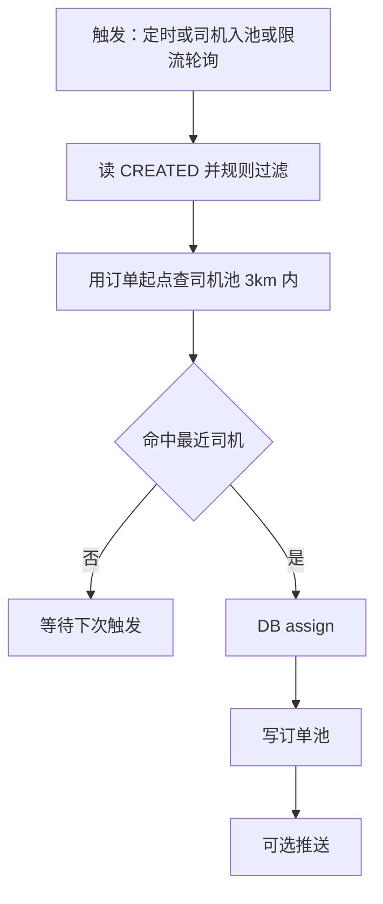
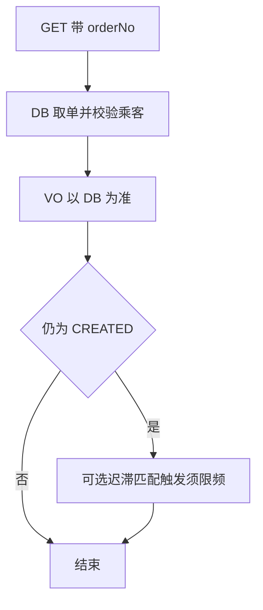
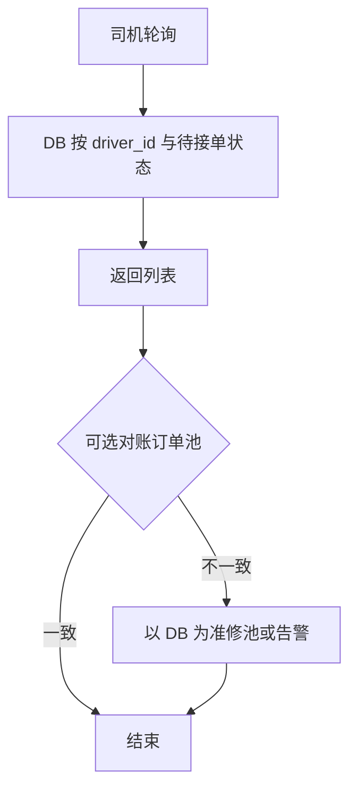
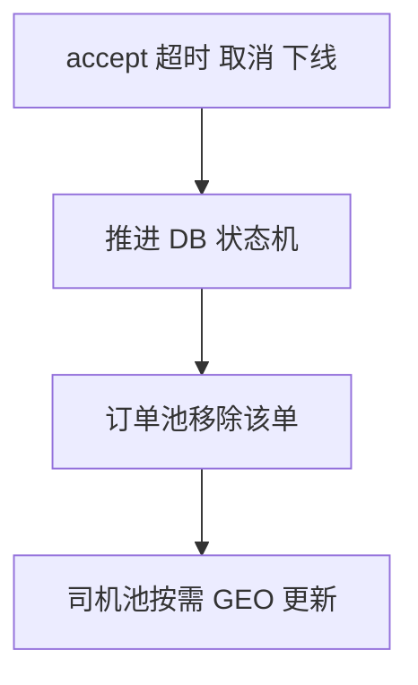
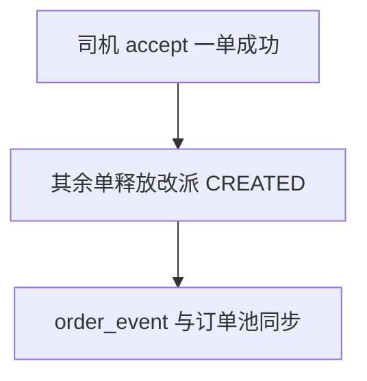

# 乘客司机端（Redis）与听单下线策略

本文记录 **司机池** 使用 **TTL + 心跳** 的原因、**司机与上车点匹配距离上限（3km）**、**下线/登出** 时对 Redis 的处理要求、**迟滞匹配** 的推荐触发方式（**入池为主 + 定时兜底**）、**listAssigned** 场景下 **多乘客命中同一司机时仅一单可生效** 的规则，以及 **下线后待接单列表** 的两种产品策略（**当前倾向策略 A**），供实现与评审时对照。

与《司机端_上线听单与接单设计.md》《乘客司机端_最小闭环接口调用文档.md》互补：本文侧重 **Redis 司机池与一致性**；状态机与接口细节以该文档及 order/capacity 实现为准。**端到端 Mermaid 流程图见 §8**；**与其它文档的分工见 §9**。

---

## 0. 术语澄清：司机池 vs 订单池（为什么大家常只提“司机池”）

为了避免误解，这里先明确本文中的两个“池”概念：

- **司机池（Driver Pool，GEO 索引）**：Redis 中表达“当前可参与匹配的听单司机及其位置”的索引。它是“找司机”的核心加速结构，因此在文档中出现频率最高。
- **订单池（Order Pool，Index，不是权威队列）**：本文所说的“订单池”是**派生索引**，常见形态为 `driverId -> orderNo 集合`（“该司机当前被指派/待确认的订单索引”），用于加速 `listAssigned`/排障对账等场景；**权威仍以订单库（order-service DB）为准**，订单池写入失败不应影响主链路。
- **重要区别**：很多人理解的“订单池”是“CREATED 待派单队列/池”。在本项目中，**CREATED 待派单的权威来源是 order-service 的 DB 查询/内部接口 + 调度扫描/入池触发**，而不是 Redis 订单池；因此你会看到大量“司机池”而很少看到“订单池队列”。

本文后续出现“订单池”时，默认指 **“指派成功后的待接单索引（派生数据）”**，不是 CREATED 的待派单权威队列。

---

## 1. 司机池是什么

**司机池**：Redis 中用于表达「当前可参与匹配的听单司机及其位置」的数据结构（例如 `GEO` + 可选元数据），与库表中的运力状态（如 `monitor_status`、是否可接单）**配合使用**——**库表为权威，Redis 为加速索引**；匹配逻辑应以「库表校验 + 池内位置」一致为前提。

### 1.1 匹配距离约束（3km）

**规则**：参与匹配的司机 **当前位置** 与订单 **上车点（乘客出发点）** 的经纬度，经 **球面距离** 计算（或工程上等价的 Haversine / 地图距离服务），**直线距离不得超过 3 km**。超过该阈值的司机 **不得** 被指派给该笔订单。

**实现提示**：可在 `GEOSEARCH` 等「最近邻」结果上 **按距离二次过滤**，或查询时即将 **半径限制为 3km**（需注意与 Redis 单位、坐标系一致）。**坐标系**须与业务约定一致（例如高德 **GCJ-02**）。**3km** 为产品口径，建议 **可配置**，便于按城市/阶段调整。

### 1.2 联调测试建议（可选）

为在本地或联调环境稳定复现「司机与乘客上车点处于可匹配范围」：可在 **听单上线** 时先调用 **高德地理编码** 走通依赖，再使用 **杭州东站周边、与东站直线距离 3km 以内** 的固定经纬度作为写入司机池的坐标（通过 **配置开关** 控制，**生产环境须关闭**，改为真实上报或合规定位）。具体开关名、假数据经纬度以实现为准。

---

## 2. TTL + 心跳的作用

仅「听单时写入一次、永不续期」时，会出现 **僵尸条目** 与 **位置失真**。因此需要 **TTL（过期时间）** 与 **心跳（或定时位置上报）**。

| 场景 | 无 TTL/心跳的风险 | TTL/心跳的应对 |
|------|-------------------|----------------|
| App 强杀、断网、崩溃，未调用下线接口 | Redis 中仍存在该司机，被错误匹配 | TTL 到期自动剔除；或心跳停止后过期 |
| 长时间听单，车辆位置已变 | 仍按旧坐标做「最近」，接驾距离失真 | 心跳携带当前坐标，顺带 `GEOADD` 更新位置并续期 |
| 服务端与客户端脱节（DB 已非听单，Redis 未删） | 仍被搜到为候选 | 下线/登出主动删池 + TTL 兜底 |

**推荐组合（概念）**：

- **心跳**：客户端按固定间隔上报（或仅在显著移动时上报），服务端更新 **司机池坐标** 并 **延长 TTL**。
- **TTL**：单次写入或续期的生存时间；超过该时间无续期则从池中移除，避免长期残留。

具体间隔、TTL 时长由产品与技术共同约定（需考虑耗电、弱网、服务端负载）。

---

## 3. 下线 / 登出必须删除 Redis 中的司机池缓存

**要求**：司机执行 **下线听单** 或 **退出登录**（以及业务上等同于「不再参与匹配」的操作）时，必须从 **司机池** 中 **删除** 该 `driverId` 对应条目（例如 `ZREM` / 删除 GEO 成员及附属 key）。

**原因**：

- 避免已下线司机仍被 **新派单** 匹配到；
- 与运力库表状态对齐，减少「Redis 有、人已走」的不一致。

**说明**：若同时维护 **订单池**（待接单索引），下线本身 **不** 必然清空「已指派给该司机的订单」记录；订单是否保留在列表上由 **第 4 节策略** 决定。但 **司机池** 必须在下线/登出时清理。

### 3.1 Redis 连接与听单入口（已拍板）

- **Redis 仅在 `capacity`（或统一基础设施层）配置并连接**；**`driver-api` 不直连 Redis**。
- **司机池 GEO 的写入 / 删除**：业务**入口**在 **`driver-api` 听单/下线相关接口**，通过 **Feign 调用 `capacity` 对内 API**，由 **`capacity` 执行** `GEOADD` / `ZREM` 等；避免两套服务各自连 Redis 导致 key 不一致。

---

## 4. 下线后：待接单列表的两种策略

下线后，订单可能仍处于 **已指派 / 待司机确认**（未超时、未改派）。此时 **`listAssigned` 是否仍返回这些单** 有两种产品取向。本文档约定：**当前倾向采用策略 A**（实现与评审以策略 A 为默认；若需切换策略 B，须更新本文档并同步改 `listAssigned` / 改派规则）。

### 4.1 策略 A：仅禁止新派单，已派单仍可见直到超时

**含义**：

- 司机 **下线** 后：**不再** 从司机池参与 **新的** 匹配（无新派单）。
- 若下线前 **已被指派** 且仍在 **待确认窗口** 内：`listAssigned` **仍可** 返回该笔订单（或司机仍可从订单详情进入确认），直到 **超时改派** / **乘客取消** / **司机主动拒单** 等规则生效。

**与再上线的关系**：

- **下线状态的司机无权再接「新」单**（无新派单）。
- 若 **在未过期的确认时间内再次上线听单**，可 **继续处理** 该笔已指派订单（接单 `accept`），与「仅禁止新派单、旧单仍可见」一致。

### 4.2 策略 B：下线后列表立刻为空

**含义**：

- 司机 **一旦下线**，**待接单列表立即为空**，即使仍有 **未超时** 的已指派单。

**影响**：

- 通常需在服务端 **`listAssigned`**（或 BFF）对 **下线状态** 做过滤，或 **主动改派/撤销司机侧可见性**（涉及 order 状态机与改派规则，需与产品、风控一致）。
- 若仍允许司机在 **再次上线** 后接 **同一笔** 未过期订单，需在 **再次上线** 时恢复列表或依赖 **订单号直达**；否则即视为 **下线即放弃本轮确认**，由调度超时改派。

---

## 5. 如何选择

| 维度 | 策略 A（旧单可见至超时） | 策略 B（下线列表立刻为空） |
|------|-------------------------|---------------------------|
| 司机短暂关 App 再开 | 不易误伤「马上回来接单」 | 列表清空，依赖再上线或推送 |
| 实现复杂度 | 相对低：列表仍以 DB 为准，下线只清司机池 | 较高：列表与在线态强绑定或需改派语义 |
| 与乘客体验 | 司机暂时离线仍可能回来点接单 | 乘客侧可能更快进入改派若司机长期不接 |

**结论（已定倾向）**：采用 **策略 A**——下线后 **仅禁止新派单**（从司机池移除，不参与新匹配）；**已指派且仍在确认窗口内** 的订单 **仍可在 `listAssigned` 中展示**，直至超时改派或取消等；司机若在 **`offer` 未过期前再次上线听单**，可继续对该单执行 `accept`。  
若后续产品要求改为策略 B（下线后列表立刻为空），须修订本文档并调整 order/BFF 与改派语义。

---

## 6. 迟滞匹配：触发方式（入池 + 定时）

**迟滞匹配**：乘客下单时 **尚无可用司机**（订单停留在 `CREATED` 等待派单状态），后续 **供给侧出现或更新** 时再执行「找最近司机 → DB `assign` → 必要时 `openDriverOffer`」等逻辑。

### 6.1 推荐组合（本文档约定）

| 角色 | 说明 |
|------|------|
| **入池触发（主）** | 司机 **新进入司机池**（听单上线、心跳恢复听单、从不可用变为可匹配等）时，触发一次 **与本区域/城市相关的待派单订单** 与 **司机池 GEO** 的匹配尝试。触发量与 **司机入池次数** 挂钩，不与乘客轮询频率线性放大，**边际成本通常最低**。 |
| **定时任务（兜底）** | 按固定周期（如十余秒至数十秒级，按体量调参）扫描 **待派单订单** 并尝试匹配，用于兜底：**入池事件丢失**、消息未达、边界漏网等。成本 **可预期**，与活跃乘客刷新次数 **解耦**。 |

**结论**：迟滞匹配以 **入池为主、定时为辅**；二者配合即可覆盖主路径与容错，无需依赖「乘客每次轮询都触发匹配」作为默认手段。

### 6.2 与乘客轮询的关系（非默认主路径）

乘客端 **订单详情轮询** 若顺带触发迟滞匹配，易按 **等派人数 × 轮询频率** 放大服务端压力；若产品需要，建议仅作 **可选补充**，且对 **同一订单** 做 **防抖/限频**（例如每单每若干秒最多尝试一次），避免与入池、定时重复劳动。

### 6.3 入池触发与定时任务叠加（已拍板）

**司机入池（每次 `GEOADD`）** 与 **定时任务（如 30s）** 可能 **在短时间内对同一批 `CREATED` 订单重复尝试 `assign`**，属预期行为。

- **处理原则**：依赖 **`assign` 侧幂等键 / 请求级幂等** + **订单状态 CAS**；若目标订单 **已被指派** 或 **条件不满足**，返回 **冲突/幂等成功**，**不当作业务异常**，**不**作为高优先级告警（避免刷屏）。
- **日志**：可打 **debug / 指标计数**，便于观察「重复尝试次数」，而非按 error 级别每条记录。

### 6.4 待派单超时与 Redis 双池（与乘客轮询解耦）

- **order-service** 定时任务：若 **`CREATED`** 在 `order.dispatch.wait-timeout-seconds`（默认 **180 秒**）内仍未被指派，则 **系统取消**（`CANCELLED`，`cancel_by=系统`），**不依赖**乘客轮询触发。
- **司机池**：仅索引听单司机位置；**待派单超时关单**不涉及从司机池删除（除非业务上另有「司机下线」操作）。
- **订单池**（待接单索引）：当前实现为 **指派成功后** 的派生索引；**`CREATED`** 未指派前 **不会** 进入该池，故 **超时关单无需清理订单池**。

---

## 7. listAssigned：多乘客命中同一司机（仅接一单，其余作废）

调度或迟滞匹配可能出现 **多名乘客的订单在短时间内先后或并发指派到同一司机**（例如同一 `driver_id` 对应多笔 `ASSIGNED` / `PENDING_DRIVER_CONFIRM`）。**现实约束**：一名司机 **同一时刻只能执行一笔** 载客业务。

### 7.1 业务约定（本文档）

- **`listAssigned`** 可能暂时返回 **多笔** 待确认订单；司机 **只能对其中一笔** 执行 **`accept`**（先成功落库者得，或按产品约定唯一一笔有效）。
- **一旦某笔订单被该司机 `accept` 成功**，其余 **已指派给该司机、仍处于待确认/未形成有效行程** 的订单 **一律释放并进入改派**（不再保留与该司机的有效指派关系），避免多名乘客同时占用同一司机。
- **释放后的落库形态（已拍板，与《司机端_上线听单与接单设计.md》中「系统取消」表述区分）**：其余订单 **统一** — **`driver_id` 清空**、订单状态回退为 **`CREATED`**，进入 **迟滞匹配 / 改派队列**（按城市扫描 `CREATED` 等实现约定）；**不是** `CANCELLED` 意义上的乘客取消。

### 7.2 实现要点（提示）

- **`accept`** 侧建议使用 **乐观锁 / CAS**（或事务内校验司机当前是否已有进行中单），保证 **仅一笔** 从待确认进入已接单；**下线后仍展示旧单** 时，**`accept` 内须做完整校验**（订单状态、`driver_id`、offer 未过期、运力可接单等，与《司机端_上线听单与接单设计.md》及本文 **§7** 一致）。
- **释放改派** 应在 **accept 成功的事务内或紧随其后的补偿流程** 中完成，并同步 **订单池**（若有）与 **司机池** 索引，避免列表与 DB 长期不一致。

### 7.3 订单表、`order_event` 与乘客展示枚举（已拍板）

**须在 `order` 服务表结构 / 迁移与实现中写明以下内容（实现以 PR 为准）。**

#### `trip_order`（或等价主表）建议字段

| 字段（示例名） | 说明 |
|----------------|------|
| 既有 **`status`** | 业务状态机（含 **`CREATED`** 等）。 |
| **`driver_id`** | 释放改派时 **置空**。 |
| **`passenger_display_code`**（或等价枚举字段） | 供乘客端展示用，**与 `status` 可组合使用**；见下表。 |

#### 乘客展示枚举 `passenger_display_code`（建议）

| 枚举值（示例） | 含义 | 典型场景 |
|----------------|------|----------|
| `WAITING_DISPATCH` | 等待派单 | 首单 `CREATED`，尚未有司机。 |
| `RE_DISPATCHING` | 改派中 | 多单场景下本单被释放、`CREATED` 待重新匹配；**与首次等派区分**，便于前端与后续运营。 |

**说明**：不要求单独做复杂「文案」系统；前端可根据 **`status` + `passenger_display_code`** 刷新展示。若某版本仅返回 `status`，也应在接口契约中预留 **`passenger_display_code`**，避免后续加字段破坏兼容。

#### `order_event` 须记录的事件类型（示例，实现时枚举落库）

| `event_type`（示例常量） | 说明 |
|---------------------------|------|
| `ORDER_REDISPATCH_RELEASED` | 因「多单一司机 accept 成功」导致本单被 **释放改派**（`driver_id` 清空 → `CREATED`）。 |
| （既有）`ORDER_ASSIGNED` / `ORDER_ACCEPTED` 等 | 与现有状态机一致。 |

**要求**：上述事件 **必须** 随状态变更写入 **`order_event`**，便于审计、排障与对账；具体字段名以 `order` 服务实体与迁移脚本为准。

---

## 8. 端到端流程图（Mermaid）

**说明**：节点文案尽量单行；**库表为权威**，Redis 双池为辅；**指派成功**指 order 服务 **`assign` + 必要时 `openDriverOffer`** 成功。

### 8.1 总体关系

### 8.2 司机听单上线

### 8.3 乘客 createAndAssign

### 8.4 迟滞匹配

### 8.5 乘客 GET 订单详情

### 8.6 司机 listAssigned

### 8.7 接单与收敛

### 8.8 多单一司机 accept 后

---

## 9. 与其它文档的分工

| 文档 | 分工 |
|------|------|
| **本文** | **司机池 / 订单池** 语义、**3km**、**TTL/心跳**、**下线删池**、**迟滞匹配**、**多单一司机**、**listAssigned 策略 A**；**§8 流程图** 以本文为准。 |
| 《`乘客司机端_最小闭环接口调用文档.md`》 | 乘客 **接口**、**H5 调用顺序**、**闭环**；**§1.1b** 引用本文，**不**重复粘贴流程图。 |
| 《`司机端_上线听单与接单设计.md`》 | **状态机**、**offer**、**5s 扫描**、**WS**、**§2.5 多笔待确认**；与本文 **§7** 互引。 |
| 《`司机端_登录注册设计.md`》 | **登出 / JWT**；**§6.6** 补充 **司机池删池** 指向本文 **§3**。 |

---

## 10. 与本文相关的实现检查清单（供开发自检）

- [ ] 听单上线：写入司机池 + 心跳续期与坐标更新策略。
- [ ] 下线 / 登出：**删除** 司机池中该司机条目。
- [ ] 匹配前：除 Redis 外，校验运力 **可接单 + 听单中**（与库表一致）；**司机位置与上车点距离 ≤3km**。
- [ ] 按 **策略 A** 实现：**listAssigned** 以 DB 中已指派待确认为准（下线不隐藏旧单）；**accept** 与「再上线听单」规则与文档一致。
- [ ] **迟滞匹配**：**入池触发为主**，**定时任务兜底**；若启用乘客轮询触发，须 **限频/防抖**。
- [ ] **多单一司机**：`accept` 成功一笔后，**其余单** 按 **§7.3** 落库（`CREATED`、清空 `driver_id`、`order_event`、`passenger_display_code`）；**listAssigned** 与缓存对账一致。
- [ ] **Redis**：仅 **capacity** 连 Redis；**driver-api** 经 Feign 写 GEO（见 **§3.1**）。
- [ ] **迟滞重复触发**：**§6.3** 幂等与日志级别。

---

*文档版本：含 §3.1 Redis 边界、§6.3 幂等叠加、§7.3 表字段与 order_event、乘客展示枚举；§8 流程图、§9 分工；3km、迟滞匹配、多单一司机、策略 A；随实现 PR 修订。*
