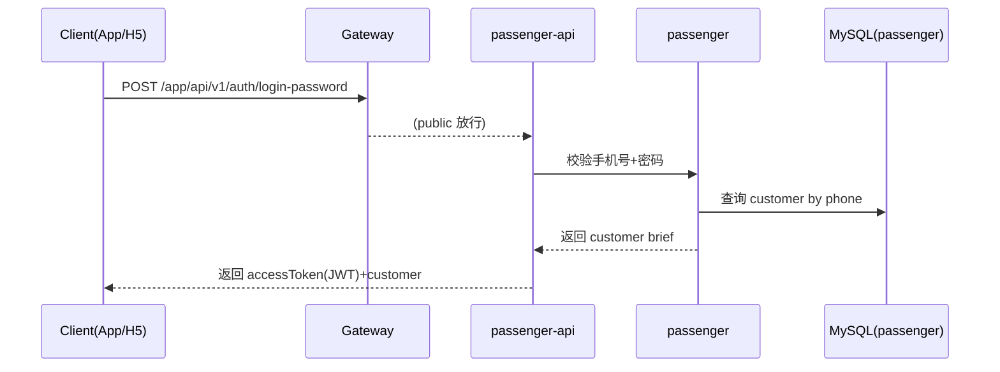
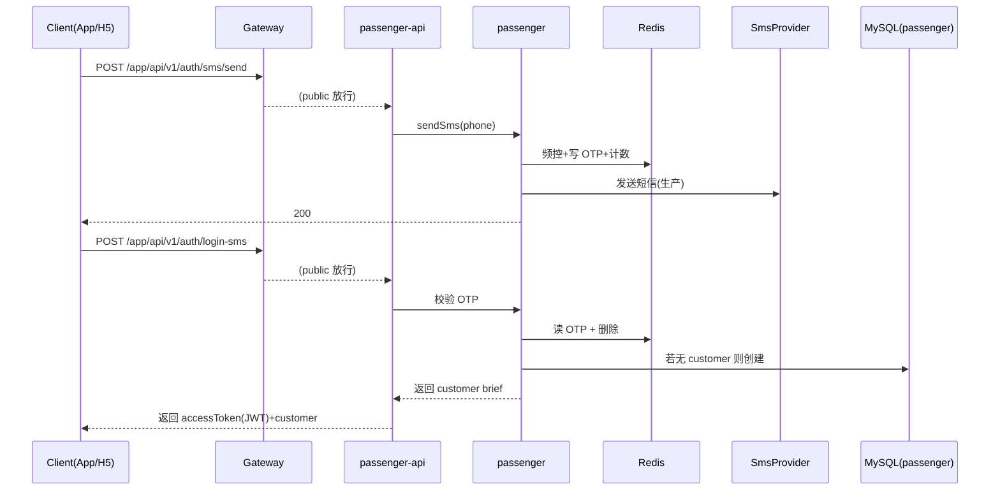

# 乘客端登录设计（密码登录 + 短信验证码登录）

本文档定义 **乘客端（App/H5）登录** 的首期设计方案：**手机号+密码** 与 **手机号+短信验证码（OTP）** 两种登录模式。  
范围包含：接口契约、JWT 约定、网关放行、基础风控（频控/次数限制）、数据与缓存键、错误码与联调要点。  
**本文档仅用于讨论设计，不包含代码实现。**

---

## 1. 背景与目标

- **现状**
  - 乘客账号表 `passenger.customer` 已存在，字段 `password_hash` 允许为空（支持“仅短信登录”或“短信后设密”路径）。
  - 网关 `gateway` 已对大部分请求做 **Bearer JWT 粗校验**（签名、exp、可选 aud），未在白名单内的接口会被 401 拦截。
  - `passenger-api`（乘客 BFF）当前订单等接口仍使用请求体/Query 传入 `passengerId`（存在被伪造风险）。

- **目标（MVP）**
  - 支持两种登录方式（两个登录接口）。
  - 登录成功后返回 **Access Token（JWT）**，后续请求统一走 `Authorization: Bearer <token>`。
  - 网关对白名单接口放行，其余 `/app/**` 要求 JWT。
  - 验证码登录具备最小必要的 **发送频控 + 日上限 + TTL + 一次性校验**。

---

## 2. 术语

- **Core**：`passenger` 服务（直接访问 `passenger` 数据库）。
- **BFF**：`passenger-api` 服务（乘客端聚合层，对外暴露 `/app/api/v1/**`）。
- **Gateway**：`gateway` 服务（统一入口，端口 8080，路由转发 `/app/**` 至 BFF）。
- **OTP**：一次性验证码（短信验证码）。

---

## 3. 数据模型（MySQL）

### 3.1 `customer`（已存在）

- **主键**：`id`
- **登录主键**：`phone`（未删除记录唯一，靠生成列 `phone_active` + 唯一索引保证）
- **密码摘要**：`password_hash`（可空）
- **状态**：`status`（0 正常；非 0 表示冻结/限制等）
- **逻辑删除**：`is_deleted`

### 3.2 OAuth 扩展（后续）

若二期引入 OAuth2（微信/支付宝等），建议新增绑定表（示例）：

- `customer_oauth_binding(provider, provider_user_id) UNIQUE`
- `customer_id` 外键关联 `customer.id`

> 本文档不展开 OAuth2 具体流程，仅预留扩展点。

---

## 4. JWT 约定（乘客端）

### 4.1 Token 类型

- **Access Token**：JWT（HMAC 签名），由 BFF 签发（建议），网关校验。

### 4.2 Claims 约定

- **`sub`**：乘客 ID（`customer.id`，字符串）
- **`exp`**：过期时间（必须）
- **`iat`**：签发时间（建议）
- **`aud`**：**必须写入** `app-bff`（与网关 `gateway.jwt.audience-app` 对齐；本方案启用 aud 校验）

### 4.3 密钥与过期时间

- **签名密钥**：与网关一致（例如统一环境变量 `JWT_SECRET`）。
- **过期时间**：**7 天**（首期仅客户端退出删除 token；不做服务端即时失效）

---

## 5. 网关放行（Public 白名单）

网关对未登录接口必须放行，否则前端无法获得 token。

白名单（`POST`，仅 3 个）：

- `/app/api/v1/auth/login-password`
- `/app/api/v1/auth/login-sms`
- `/app/api/v1/auth/sms/send`

其他 `/app/**` 均要求 `Authorization: Bearer <token>`（无“无登录试玩”需求）。

同时建议开启网关 `aud` 校验（`gateway.jwt.audience-check-enabled=true`），以防止跨端误用 token：

- `/app/**` 仅接受 `aud=app-bff`
- `/admin/**` 仅接受 `aud=admin-bff`
- `/driver/**` 仅接受 `aud=driver-bff`

---

## 6. API 设计（对外：BFF）

统一前缀：`/app/api/v1/auth`

### 6.1 发送短信验证码

- **POST** `/app/api/v1/auth/sms/send`

请求：

```json
{
  "phone": "13800138000"
}
```

响应（成功）：

```json
{ "code": 200, "msg": "success", "data": null }
```

失败：
- `400`：手机号格式非法
- `429`：发送过于频繁 / 今日次数已达上限

### 6.2 验证码登录

- **POST** `/app/api/v1/auth/login-sms`

请求：

```json
{
  "phone": "13800138000",
  "code": "123456"
}
```

响应（成功）：

```json
{
  "code": 200,
  "msg": "success",
  "data": {
    "accessToken": "<jwt>",
    "tokenType": "Bearer",
    "expiresIn": 604800,
    "customer": {
      "id": 10001,
      "phone": "13800138000",
      "nickname": "乘客A"
    }
  }
}
```

失败：
- `401`：验证码错误或过期
- `403`：账号冻结

行为规则：
- OTP 校验成功后 **一次性删除**（防复用）
- 若手机号在 `customer` 不存在：**自动注册**（创建 customer，`password_hash` 为空）

### 6.3 密码登录

- **POST** `/app/api/v1/auth/login-password`

请求：

```json
{
  "phone": "13800138000",
  "password": "plaintext"
}
```

响应（成功）同 6.2。

失败：
- `401`：手机号或密码错误
- `403`：账号冻结

行为规则：
- 若 `password_hash` 为空：直接拒绝（401），并提示“请使用验证码登录”

---

## 7. API 设计（对内：Core）

建议 BFF 不直接访问数据库，统一通过 Core 完成以下动作：

- `login-password`（验密）
- `sms/send`（写 OTP + 频控 + 发送）
- `login-sms`（验 OTP + 自动注册）

Core 返回给 BFF 的数据应尽量小：`customerId/phone/nickname/status`，由 BFF 负责签 JWT。

---

## 8. Redis 设计（OTP 与频控）

### 8.1 Key 约定（建议）

- **OTP**：`app:otp:{phone}` → `code`（TTL = 300s）
- **发送间隔锁**：`app:sms:gap:{phone}` → `1`（TTL = 60s）
- **每日计数**：`app:sms:daily:{phone}:{yyyy-MM-dd}` → `count`（TTL ≈ 2d）
- **登录失败计数**：`app:login:fail:{phone}:{yyyy-MM-dd}` → `count`（TTL ≈ 2d，密码+验证码合并计算）
- **登录禁用标记（当日）**：`app:login:ban:{phone}:{yyyy-MM-dd}` → `1`（TTL ≈ 2d）

### 8.2 频控规则（建议）

- 同手机号发送间隔：≥ 60 秒
- 同手机号日上限：≤ 5 次（可配置）
- OTP：
  - 6 位数字
  - TTL 300 秒
  - 校验成功后删除
- 登录失败限制（同手机号，密码/验证码合并）：
  - 当日失败次数上限：5 次
  - 达到上限后：当日禁止登录成功（返回 429；见 §9）

---

## 9. 错误码与提示语（建议）

统一沿用 `ResponseVo`：

- `200` success
- `400` 参数错误（手机号格式、缺参）
- `401` 未授权（密码错、验证码错/过期、缺 token）
- `403` 禁止（账号冻结）
- `429` 频控（发送过快/达上限；或当日登录失败达上限）
- `500/502/504` 下游异常（BFF 调 Core 或其它服务失败）

提示语原则：
- 登录失败尽量 **模糊**（不泄漏是否注册）
- 频控错误需明确（“请稍后再试”“今日上限”）

建议文案口径（首期统一）：

- 密码登录失败（401）：`手机号或密码错误`
- 验证码登录失败（401）：`验证码错误或已过期`
- 密码登录但未设置密码（`password_hash` 为空，401）：`请使用验证码登录`
- 账号冻结（403）：`账号已冻结，请联系客服`
- 短信发送过于频繁（429）：`发送过于频繁，请稍后再试`
- 短信发送达日上限（429）：`今日验证码发送次数已达上限，请明天再试`
- 登录失败达日上限（自然日 5 次，429）：`登录失败次数过多，请明天再试`

---

## 10. 端到端流程（时序）

### 10.1 密码登录



### 10.2 验证码登录



---

## 11. 与现有订单接口的身份衔接（必须讨论）

现有 `/app/api/v1/orders` 请求体里携带 `passengerId`。登录上线后按本方案 **统一从网关注入头 `X-User-Id`（JWT `sub`）获取乘客 ID**：

1. 业务侧 **不信任** 请求体/Query 中的 `passengerId`
2. 实现策略：逐步移除 `passengerId` 入参；在移除前的过渡期可保留但必须校验一致（不一致则 401/403）

否则存在“伪造 passengerId 越权访问/下单”的风险。

---

## 12. 二期演进（非 MVP）

- **改密/踢下线**：引入 `token_version`（类似后台 `sys_user.token_version`），JWT 带 `tv` 并在每次请求校验/缓存（成本更高）。
- **Refresh Token**：短 access + 长 refresh，支持退出登录与轮换。
- **更强风控**：设备指纹、IP 限制、黑名单、验证码图形/滑块。
- **OAuth2 登录**：新增绑定表、回调处理、PKCE/state、账号合并策略；OAuth 成功后仍签发自建 JWT 以复用网关验签模型。

---

## 13. 配置建议（示例）

- 网关：`gateway.jwt.secret` 与 `audience-app`
- BFF：`app.jwt.secret`（与网关一致）、`app.jwt.expiration-seconds`
- Core：短信频控与 OTP TTL（Redis）

> 实际 key 与配置命名可在实现时统一（保持可读与可迁移）。

