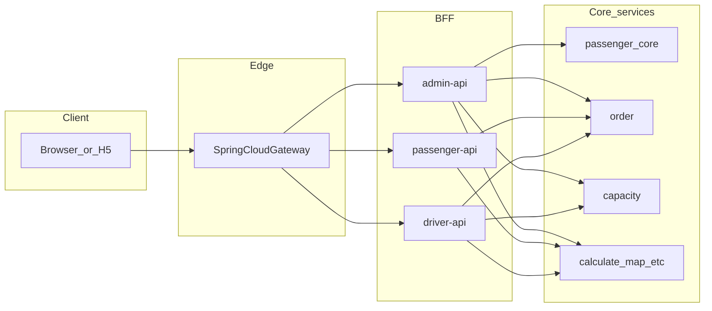

# 网关服务设计

本文档描述 **统一 API 网关**（计划采用 **Spring Cloud Gateway**）的职责边界、路由与跨域策略、JWT 分层校验及与三个 BFF、核心服务的关系，供实现与评审对齐。  
**不替代**各域接口契约文档；具体超时阈值、Resilience4j 参数、黑名单规则等在实现阶段另案细化。

---

## 1. 文档范围

| 包含 | 不包含 |
|------|--------|
| 浏览器统一入口、到 `admin-api` / `passenger-api` / `driver-api` 的路由 | 各核心服务 REST 契约细节（见各域接口文档） |
| **CORS**：唯一权威在网关；OPTIONS 预检与错误响应原则 | 具体 Allow-Origin 白名单枚举（环境相关，实现时配置） |
| **JWT**：网关校验签名、`exp`、`iss`/`aud` 及按 BFF 区分；BFF 细粒度权限 | `aud`/`iss` 具体取值、签发侧改造任务列表（实现时落地） |
| 健康、日志、Request-Id、超时/熔断/降级的**目标语义** | Resilience4j 数值、告警规则、WAF/黑名单产品选型 |
| 长连接（WebSocket 等）**预留决策位** | 本期长连接实现 |

**关联文档**：《后台管理系统_权限清单与鉴权设计.md》《后台管理系统_权限与接口文档.md》；**实现与联调**见《[网关服务_技术.md](网关服务_技术.md)》。  
三个 BFF 本地端口以各模块 `application.yml` 为准（当前常见为 **8099 / 8100 / 8101**）。

---

## 2. 架构与流量边界

- **浏览器、H5、管理前端**仅访问 **网关**；**order / capacity / calculate / map / passenger（核心服务）等不经过网关对浏览器暴露**。
- 三个 BFF（`admin-api`、`passenger-api`、`driver-api`）通过 **Feign** 等方式调用核心服务；核心服务只接受内网或约定边界的流量。

---

## 3. 路由约定

网关按 **路径前缀** 将请求转发至对应 BFF；前缀与 BFF Controller 的 **真实路径** 保持一致，**不**对业务路径做 `StripPrefix`（除非未来 BFF 增加统一 `context-path` 后再统一调整）。

| 网关匹配前缀 | 转发目标（示例 URI） | 说明 |
|--------------|----------------------|------|
| `/admin/**` | `http://<admin-api-host>:8099` | 与 `admin-api` 下 `/admin/api/v1/**` 等一致。 |
| `/app/**` | `http://<passenger-api-host>:8100` | 与 `passenger-api` 当前 **`/app/api/v1/**`** 对齐；**不是** `/passenger/**`。 |
| `/driver/**` | `http://<driver-api-host>:8101` | 与 `driver-api` 下 **`/driver/api/v1/**`** 对齐。 |

**禁止**：将 `order`、`capacity`、`calculate`、`map` 等核心服务端口挂到公网网关路由上供浏览器直调（服务间调用仍走 BFF 或内网注册发现，协议栈可与网关路由分离）。

---

## 4. CORS（唯一权威在网关）

- **原则**：面向浏览器的 **`Access-Control-Allow-*`** 仅在 **网关** 配置与生效；三个 BFF 侧对浏览器的 CORS **应逐步下线或收紧**（仅信任来自网关的转发），避免 **双端重复下发**导致规则冲突或预检行为不一致。
- **OPTIONS 预检**：跨域场景下浏览器可先发 **OPTIONS**「探路」。网关须保证 **预检响应** 与 **实际 GET/POST/PUT/DELETE 等** 使用 **一致** 的 CORS 策略。
- **错误响应**：**401 / 403 / 502 / 504** 等仍须能带上与成功路径一致的 CORS 头，否则前端会误报「被 CORS 拦截」。实现时需注意 Gateway / Security / 全局异常处理与 CORS 过滤器的顺序。
- **Credentials**：若未来前端使用 **`credentials: true`**（Cookie 等），**不能使用** `Access-Control-Allow-Origin: *`，须 **显式枚举** 允许的 Origin。

---

## 5. JWT：网关与 BFF 分工

### 5.1 共享密钥与算法

- 网关与三个 BFF **共用同一套签名算法与密钥**（如 HMAC 密钥或同一套非对称验签公钥），保证验签结论一致。
- **配置来源**：优先环境变量；后续可迁入配置中心（参见《权限清单》后续演进）。

### 5.2 网关职责（粗校验）

- 校验 **签名**、**`exp`**（及不可信时钟下的合理策略）、声明的 **`iss` / `aud`**。
- **实现补充**：开发环境可通过配置 **`gateway.jwt.require-auth=false`**（或 **`GATEWAY_JWT_REQUIRE_AUTH=false`**）暂时关闭边缘 JWT 校验，便于联调；**生产必须保持开启**，详见《[网关服务_技术.md](网关服务_技术.md)》§6.4。
- **按路由区分 BFF**：进入 `/admin/**` 的流量，JWT 的 `aud`（或与 `iss` 的组合约定）须符合 **管理端**；`/app/**`、`/driver/**` 同理对应 **乘客端 / 司机端**，防止 **跨端复用 token** 访问错误 BFF。
- 网关 **不做**：菜单权限、`token_version` 踢下线、省/市数据域等 **业务细粒度鉴权**。

### 5.3 BFF 职责（细校验）

- **admin-api** 等继续完成 **业务鉴权**（如 `sys_*` 菜单、`AdminDataScope`、`token_version` 与 Redis 安全上下文等），与《权限清单》既定模型一致。
- **演进说明**：文档《权限清单》中「首期仅由 `admin-api` 校验 JWT」指 **无网关阶段**；**上线网关后** 约定为：**网关在边缘完成 JWT 粗校验，BFF 仍保留细粒度逻辑**（含必要时对载荷的再次读取），而非「BFF 完全不再处理 JWT」。

### 5.4 下行信任头

- 网关在校验通过后，可向 BFF 注入 **`X-User-Id`**（或团队约定的等价头，与 `sub` 对齐）。
- **必须剥离**客户端原始请求中同名头，防止伪造；BFF 仅信任 **来自网关内网链路** 的注入值（具体网络隔离与肩并肩部署在实现时定义）。

---

## 6. 健康检查、日志与韧性

### 6.1 健康

- **网关自身**：`actuator/health` 等用于编排与发布探活。
- **下游 BFF**：是否在网关上聚合探测由运维策略决定；文档只要求 **区分「网关活着」与「业务路径可用」**，避免误将下游故障当成网关完全不可用（策略待实现时定）。

### 6.2 日志与追踪

- 网关 **生成或透传** **Request-Id**（或与既有 **`traceId`** 约定对齐），并打入访问日志，便于与 Zipkin / OpenTelemetry 等关联。

### 6.3 超时、熔断与降级

- **优先级**：可置于路由稳定、CORS、JWT 之后迭代。
- **目标语义**：下游超时或熔断时，对客户端返回 **稳定、可解析** 的 JSON 与合适 HTTP 状态码，且响应仍满足 **CORS**；对用户提示宜 **模糊**、对内日志与指标 **细分原因**。具体熔断阈值、是否舱壁隔离在实现阶段定义。

---

## 7. 长连接（预留）

- **WebSocket / 推送** 等多半需要：**独立路由**、可能 **更长 idle 超时**、多实例网关时是否 **会话粘性** 的决策。
- **本期不实现**，仅在本节占位，避免路由与端口规划与未来协议升级冲突。

---

## 8. 技术栈与实现边界

- **Spring Cloud Gateway**（WebFlux / Netty），与父工程 **Spring Boot 3.3.x**、**Spring Cloud 2023.0.x**（以根 `pom.xml` 为准）对齐，单独 `gateway` 模块纳入多模块工程。
- **避免**在网关过滤器中编写 **阻塞式 I/O**（如同步 JDBC）；鉴权以 **无状态 JWT 校验** 为主，勿将网关做成「小号业务服务」。

---

## 9. 修订记录

| 日期 | 说明 |
|------|------|
| 2026-04-04 | 初稿：路由、CORS 权威、JWT 分层、健康与韧性原则、长连接占位 |
| 2026-04-04 | §1 关联《网关服务_技术》 |
| 2026-04-05 | **重建**：文件在仓库中缺失，按已定稿内容恢复；链接统一为 `网关服务_技术.md` |
| 2026-04-06 | §5.2：补充 `require-auth` / `GATEWAY_JWT_REQUIRE_AUTH` 仅用于本地联调 |

*随网关落地与评审迭代修订。*
